<p align="center">
  
</p>

<p align="center">
  <a href="https://github.com/Geethen/aef_loader_plus/actions/workflows/tests.yml"></a>
  
  <a href="LICENSE"></a>
  <a href="https://github.com/astral-sh/uv"></a>
  <a href="https://github.com/astral-sh/ruff"></a>
  <br>
  <a href="https://github.com/zarr-developers/VirtualiZarr"></a>
  
  <a href="https://source.coop/tge-labs/aef"></a>
  
  <a href="https://github.com/jakenotjay/aef-loader"></a>
</p>

<p align="center">
  <b>Stream <a href="https://developers.google.com/earth-engine/guides/aef_on_gcs_readme">AlphaEarth Foundations</a> (AEF) satellite embeddings<br>
  from cloud-optimised GeoTIFFs into lazy, analysis-ready xarray/dask cubes.</b><br>
  No downloads up front, no data duplication: only the blocks you touch are fetched.
</p>

<p align="center">
  <a href="#-installation">Install</a> ·
  <a href="#-quick-start">Quick start</a> ·
  <a href="#-extracting-embeddings">Extract</a> ·
  <a href="#-chips">Chips</a> ·
  <a href="#-tessera-embeddings">TESSERA</a> ·
  <a href="#-performance">Performance</a> ·
  <a href="docs/CHANGES.md">Changelog</a>
</p>

---

## ✨ Features

| | |
|---|---|
| 🛰️ **Lazy cloud cubes** | Opens AEF COGs as virtual Zarr stores via [VirtualiZarr](https://github.com/zarr-developers/VirtualiZarr) + [virtual-tiff](https://github.com/virtual-zarr/virtual-tiff). One `DataTree` group per UTM zone, `(time, band, y, x)`, int8 with `-128` nodata. |
| 🔎 **Fast index search** | Sync `AEFIndex.search()` over a slim ranged index download (~9 MB instead of ~78 MB). Bboxes in any CRS (`bbox_crs=`), with an optional exact footprint crop. |
| ⚡ **One-liners** | `open_aef(bbox, year)` does index + search + open in one call and is notebook-safe (no `asyncio.run()` errors in Jupyter). |
| 📍 **Point & zonal extraction** | `extract_points` / `extract_zonal` sample on each tile's native grid, dequantize before averaging, and combine polygons across tiles and UTM zones correctly. |
| 🧩 **Chips** | `read_chip` / `read_chips` return fixed-size native-grid windows for ML, mosaicking across tile edges and sharing blocks between chips. |
| 🗺️ **Mosaic-safe grids** | `aoi_geobox` builds lattice-snapped grids; `reproject_datatree` combines zones and refuses lossy resampling on quantized int8. |
| 🌍 **Two sources, two datasets** | AEF from Source Cooperative (free) or GCS (requester pays), plus [TESSERA](https://geotessera.org) embeddings via `open_tessera`. |
| 💾 **Caching & throttling** | On-disk/in-memory manifest cache with freshness validation, an optional compressed-block LRU, and a global read-concurrency limit. |

## 🚀 What this fork adds

Everything upstream does still works the same way. The import name is still `aef_loader`. On top of that:

<table>
<tr><th>⚡ Performance</th><th>🧰 New APIs</th><th>🛡️ Correctness &amp; robustness</th></tr>
<tr valign="top"><td>

- `chunks=None` no longer reads whole tiles (~200 s → **2 s** to open two tiles)
- `chunks="native" | "balanced" | "all-bands"`
- Manifest (COG header) cache: **~100×** faster reopen
- LUT-based `dequantize_aef`: **1.7×** faster
- Slim ranged index download (~9 MB)
- Opt-in compressed-block LRU (`block_cache_bytes`)
- Global read limit (`max_read_concurrency`)

</td><td>

- `open_aef` / `aopen_aef`
- `extract_points` / `extract_zonal` (+ async twins)
- `read_chip` / `read_chips` and `Chip`
- `open_tessera` (TESSERA, 128 bands)
- `aoi_geobox`
- `AEFIndex.search(bbox_crs=..., exact=...)`
- `manifest_validation="head"` for cached manifests
- `reader.stats` counters

</td><td>

- GeoTIFF pixel-scale/tiepoint affine fixed
- Mixed-CRS tile grouping and index CRS parsing fixed
- Stale headers/pixels no longer served after an object is replaced
- Zone merges keep int8, `-128` nodata, and first-zone-only variables
- Race-free manifest cache writes and single-flight index load
- `reproject_datatree` guards against lossy int8 resampling
- geopandas/shapely now optional (`[exact]` extra)

</td></tr>
</table>

Details and measurements: [docs/CHANGES.md](docs/CHANGES.md) · [docs/PERFORMANCE.md](docs/PERFORMANCE.md) · [docs/chip-benchmarks.md](docs/chip-benchmarks.md)

## 📦 Installation

Requires **Python 3.12+**.

```bash
pip install git+https://github.com/Geethen/aef_loader_plus.git
# or
uv add git+https://github.com/Geethen/aef_loader_plus.git
```

For `search(..., exact=True)` (true footprint intersection), install the `exact` extra (geopandas and shapely):

```bash
pip install "aef-loader-plus[exact] @ git+https://github.com/Geethen/aef_loader_plus.git"
```

> [!WARNING]
> The import name is still `aef_loader`, so this package conflicts with the upstream `aef-loader`
> distribution. Install one or the other in an environment, not both.

<details>
<summary><b>Development setup</b></summary>

```bash
git clone https://github.com/Geethen/aef_loader_plus.git
cd aef_loader_plus
uv sync --extra dev
uv run python -m pytest -m "not slow"  # offline tests
uv run python -m pytest -m slow        # live tests (hit Source Cooperative)
```

</details>

## 🏁 Quick start

### One-liner

```python
from aef_loader import open_aef

tree = open_aef((5.55, 58.65, 5.65, 58.75), 2024)   # DataTree, one group per UTM zone
```

`open_aef` downloads and loads the index (shared per source, so repeated calls are cheap), searches it
and opens the tiles lazily. It is notebook-safe: with no running event loop it uses `asyncio.run`,
and inside Jupyter it runs the work on a fresh loop in a worker thread. In a notebook you can also write
`tree = await aopen_aef(bbox, 2024)`.

### Full control

```python
import asyncio
from aef_loader import AEFIndex, VirtualTiffReader, DataSource
from aef_loader.utils import reproject_datatree
from odc.geo.geobox import GeoBox

async def main():
    # Source Cooperative (the default) is free and needs no auth;
    # use DataSource.GCS with gcp_project=... for the requester-pays bucket
    index = AEFIndex(source=DataSource.SOURCE_COOP)
    await index.download()
    index.load()

    bbox = (-122.5, 37.5, -122.0, 38.0)
    tiles = index.search(bbox=bbox, years=(2020, 2023))

    async with VirtualTiffReader(manifest_cache_dir="aef-manifests") as reader:
        tree = await reader.open_tiles_by_zone(tiles, chunks="balanced", bbox=bbox, bbox_crs="EPSG:4326")

    for zone in tree.children:
        ds = tree[zone].ds
        print(f"{zone}: {ds.odc.crs}, {dict(ds.sizes)}")

    target = GeoBox.from_bbox(bbox=bbox, crs="EPSG:4326", resolution=0.0001)
    combined = reproject_datatree(tree, target)

asyncio.run(main())
```

## 📍 Extracting embeddings

Points and polygons are sampled on each tile's native grid. Nothing is reprojected or mosaicked,
and values are dequantized before any averaging, because the code-to-value map is nonlinear.

```python
from aef_loader import extract_points, extract_zonal
from shapely.geometry import box

pts = extract_points([(5.6, 58.7), (5.61, 58.705)], 2024)          # one row per (point, year)
zon = extract_zonal([box(5.600, 58.700, 5.603, 58.702)], (2023, 2024), stat="mean")
```

- **`extract_points`** returns `point_id, year, x, y, tile_id, utm_zone` plus `A00..A63` (float32, NaN
  for nodata; `dequantize=False` gives the int8 codes with `-128`). Points outside every tile, or in
  a year without a tile, get NaN rows with `tile_id=None`. A point exactly on a pixel edge belongs to
  the pixel to its right/below. Each tile is opened once and all points are read with one pointwise
  selection and a single `dask.compute`.
- **`extract_zonal`** returns `polygon_id, year, n_pixels` plus the 64 statistic columns
  (`stat` = `mean`, `median`, `std`, `min`, `max` or `count`). Polygons that span tiles or UTM zones
  are combined from per-tile sums and counts, not means of means; pixels covered by two zones are
  counted once. Polygons can be shapely geometries or a GeoDataFrame (`crs=` for other CRSs).
- **`aextract_points`** and **`aextract_zonal`** are the async twins (use them with `await` in notebooks).

## 🧩 Chips

`read_chip` and `read_chips` return fixed-size windows of raw codes on a tile's
native 10 m grid (no resampling), north-up, mosaicking neighbouring tiles when a
chip crosses a tile edge. `read_chips` opens each tile once and computes all windows
of a tile group together, so a stored block shared by several chips is fetched once.

```python
from aef_loader import VirtualTiffReader, read_chips

async with VirtualTiffReader(block_cache_bytes=512 * 2**20) as reader:
    chips = await read_chips(
        [(5.6, 58.7), (5.61, 58.71)], size=256, years=2024, index=index, reader=reader
    )
chips[0].data.shape  # (time, band, y, x) == (1, 64, 256, 256), int8
```

> [!TIP]
> The stored 1024 px block is the minimum read: a 256 px chip costs 64 GETs (about 28 MB).
> `block_cache_bytes` adds an in-memory LRU of compressed blocks, so later calls on the same reader
> skip the network for blocks already read (see `reader.stats`). The chip is centred on the pixel
> containing the point, at index `size // 2`.

## 🌐 TESSERA embeddings

Besides AEF, `open_tessera` reads [TESSERA](https://geotessera.org) embeddings (128 bands, 10 m, yearly 2017–2025)
from the [Source Cooperative Zarr store](https://source.coop/tessera/tessera/zarr/v1.1-dclimate). It returns the same
DataTree-by-UTM-zone layout as the AEF reader, so `reproject_datatree` works on it.

```python
from aef_loader import open_tessera, reproject_datatree
from odc.geo.geobox import GeoBox

bbox = (5.6, 58.7, 5.63, 58.72)
tree = open_tessera(bbox, years=(2023, 2024), dequantize=True)   # lazy, nothing downloaded yet
target = GeoBox.from_bbox(bbox, crs="EPSG:4326", resolution=0.0002)
ds = reproject_datatree(tree, target, resampling="bilinear").compute()
```

- `dequantize=False` (default) returns int8 `embeddings` plus per-pixel `scales` (value = `embeddings * scales`);
  `dequantize=True` returns float32 with water and never-written pixels as NaN.
- `years` is a year, an inclusive `(start, end)` tuple, or a list; `zones=[31, 32]` forces UTM zones;
  `include_quality=True` adds the Sentinel observation-count variables.
- Bboxes may be in any CRS (`bbox_crs=`). Southern-hemisphere sites use the same `utmNN` groups (north-referenced, negative northings).
- TESSERA is produced by the University of Cambridge; check its [licence terms](https://geotessera.org) before redistributing.

## 📊 Performance

| Measurement | Before | After |
|---|---:|---:|
| `open_tiles_by_zone(chunks=None)`, 2 tiles | ~200 s | **1.97 s** |
| Manifest rebuild per tile (parse → cache load) | 1.65 s | **15.9 ms** |
| `dequantize_aef`, 2048² × 64 window | 2702 ms | **1582 ms** |
| Index download for `search()` | ~78 MB | **~9 MB** |

For warm reads of 1024 px and larger chips, `chunks="all-bands"` (one dask task per stored block)
is about **1.5–2× faster** than the default per-band `"native"` chunking. Sources and methods are in
[docs/CHANGES.md](docs/CHANGES.md) and [docs/chip-benchmarks.md](docs/chip-benchmarks.md).

## ☁️ Hosts

| Host | Access | Notes |
|---|---|---|
| [Source Cooperative](https://source.coop/tge-labs/aef) | Free, AWS S3 | Full range 2017–2025. **Recommended** |
| [Google Cloud Storage](https://developers.google.com/earth-engine/guides/aef_on_gcs_readme) | Requester pays (needs `gcp_project`) | Maintained by the Earth Engine team |

## 🗂️ Repository layout

| Path | Contents |
|---|---|
| `aef_loader/` | The package |
| `tests/` | Offline pytest suite |
| `benchmarks/` | Benchmark scripts and raw results (`pip install -e ".[benchmark]"`) |
| `docs/` | Change log, performance notes, benchmarks, upstream README and diff |

## 🙏 Acknowledgements and licence

- Fork of **[jakenotjay/aef-loader](https://github.com/jakenotjay/aef-loader)** by Jake Wilkins (Apache-2.0), forked at
  commit `feff13e`. All credit for the original design and implementation goes to the upstream project;
  see [NOTICE](NOTICE) and [docs/UPSTREAM_README.md](docs/UPSTREAM_README.md).
- Thanks also to Max Jones ([virtual-tiff](https://github.com/virtual-zarr/virtual-tiff))
  and [VirtualiZarr](https://github.com/zarr-developers/VirtualiZarr).
- Code is licensed under [Apache-2.0](LICENSE).
- Dataset attribution (CC-BY 4.0): "The AlphaEarth Foundations Satellite Embedding dataset is produced by Google and Google DeepMind."
