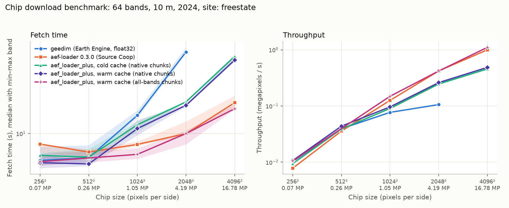

# Benchmarks

Chip download benchmarks comparing Earth Engine (geedim), upstream [aef-loader](https://github.com/jakenotjay/aef-loader), and aef-loader-plus. See the [README](../README.md) for installation.

## Chip download benchmark: Earth Engine (geedim) vs Source Cooperative (aef-loader, aef-loader-plus)

Measured on 29 September 2026 (raw results: [benchmarks/chip_results_2026-09-29.json](../benchmarks/chip_results_2026-09-29.json)) with
[benchmarks/compare_chip_download.py](../benchmarks/compare_chip_download.py).

### What was downloaded

- **Chip:** 64 bands, 2024, native 10 m UTM 31N grid, with no resampling. Upper-left corner at (648000 E, 6526000 N), on land at Jæren, south of Stavanger, Norway.
- **Tile layout:** the chip lies inside a single AEF tile (`31N/xbishs9u127yarggl`). It is not aligned to the 1024 × 1024 COG blocks: the 256 px chip sits inside one block, and the 1024 px chip covers four.
- **Runs:** each one is a fresh Python process. There were 5 timed repeats per method and size, and the method order rotated between repeats.
- **Machine:** Windows 11 work laptop on an office network.

| Method | Source | Returned dtype | Version |
|---|---|---|---|
| `geedim` | Earth Engine `GOOGLE/SATELLITE_EMBEDDING/V1/ANNUAL`, via `prepareForExport(crs, crs_transform, shape, dtype="float32").gd.toNumPy()` on the high-volume endpoint | float32, dequantized | geedim 2.0.0, earthengine-api 1.7.46 |
| `upstream` | Source Cooperative COGs, `open_tiles_by_zone(tiles)` with default chunks (1024² blocks), then window and `.values` | int8 codes | aef-loader 0.3.0 (PyPI) |
| `plus` | Source Cooperative COGs, `open_tiles_by_zone(tiles, chunks="native", bbox=chip, bbox_crs="EPSG:32631")` with an empty manifest cache | int8 codes | aef-loader-plus |
| `plus_warm` | as `plus`, but the on-disk manifest cache was already populated | int8 codes | aef-loader-plus |

Environment: pixi, conda-forge Python 3.12. The packages were virtual-tiff 0.5.0, virtualizarr 2.7.3, obstore 0.11.1, zarr 3.4.0, xarray 2026.7.0 and dask 2026.8.0.

### Results

**Fetch time** is measured from the moment the chip is requested until a NumPy array is in memory. It starts after Earth Engine is initialized, or after the AEF index is loaded and queried. The figures are the median and range over 5 runs, in seconds.

**Instrumentation.** Each Source Cooperative run also records `obstore_requests` and
`obstore_bytes` (calls to, and bytes returned by, the `obstore` get/get_range(s) functions,
which is where VirtualiZarr issues its reads; requests made entirely inside Rust are not
seen), `peak_rss_bytes` for the worker process, and splits wall time into `open_s`,
`build_s` (graph construction) and `read_s`. These are `null` for Earth Engine.

First instrumented live run (30 September 2026, one repeat, native chunks): a 256 × 256
chip took 64 range requests (one 1024 × 1024 block per band) plus 2 header requests when
the manifest cache was cold, and received **28.0 MB to deliver a 4.2 MB int8 payload
(about 6.7× read amplification)**. A 1024 × 1024 chip spanning four blocks took 256
requests and 111 MB for a 67 MB payload. The whole compressed block is the minimum read,
which is why small chips cost far more than their payload.


| Chip | Method | Payload | Fetch | Open (header/manifest) | Read (pixels) |
|---|---|---:|---:|---:|---:|
| 256 × 256 × 64 | geedim | 16.8 MB float32 | **6.95** (5.89–7.67) | n/a | n/a |
| | upstream | 4.2 MB int8 | 7.31 (7.18–7.74) | 2.95 | 4.39 |
| | plus (cold cache) | 4.2 MB int8 | 8.85 (8.53–9.35) | 3.61 | 5.22 |
| | plus (warm cache) | 4.2 MB int8 | 7.43 (7.20–8.03) | **1.70** | 5.73 |
| 1024 × 1024 × 64 | geedim | 268 MB float32 | 13.29 (13.14–15.14) | n/a | n/a |
| | upstream | 67 MB int8 | **12.05** (8.45–17.40) | 3.06 | 8.84 |
| | plus (cold cache) | 67 MB int8 | 14.08 (11.01–15.58) | 3.52 | 10.55 |
| | plus (warm cache) | 67 MB int8 | 11.59 (10.66–13.35) | **1.70** | 10.06 |

**Fixed start-up costs** are paid once per process, not per chip:

| Step | Time |
|---|---:|
| Source Cooperative index parquet download (78 MB, then cached on disk) | 29.9 s, one-off |
| `ee.Initialize` + imports (geedim) | ~10 s |
| Imports + index load + query (aef-loader installed on local disk) | ~2.5 s load/query; 7.8 s total incl. numpy/xarray imports |
| Imports from `P:\` network drive (aef-loader-plus, as run here) | +8 to 9 s. This is an artefact of the network drive: the same fork copied to local disk imports in 1.3 to 2.6 s, like the PyPI package |

### Integrity

- **Upstream vs fork:** `upstream` and `plus` returned byte-identical int8 arrays at both chip sizes.
- **Earth Engine vs Source Cooperative:** dequantizing the Source Cooperative int8 codes with `(v/127.5)² · sign(v)` reproduces the Earth Engine float32 values to within float32 rounding. The largest absolute difference was 2.98e-8 and the mean was 5.7e-9, with no nodata in the chip.
- **Conclusion:** all three routes deliver the same embeddings.

### Interpretation

- **Speed:** for one chip, all three routes finish within about 1.5 s of each other. None is clearly faster at either size.
  - At 256 px, geedim was marginally quickest.
  - At 1024 px, upstream and warm-cache plus were marginally quickest.
  - The upstream runs varied the most (8.5 to 17.4 s at 1024 px).
- **Why the Source Cooperative read is the bottleneck:** the smallest unit that can be read from a COG is a whole 1024 × 1024 × 64 block (64 MB of int8 before compression).
  - A 256 px chip costs as much network traffic as a full block, about 4 to 6 s here.
  - The 1024 px chip, which covers four blocks, needs about 9 to 10 s.
  - The fork's `bbox` crop does not reduce this, because the COG block size sets the minimum read. This matches the Stavanger demo in PERFORMANCE.md.
- **Earth Engine size:** Earth Engine returns only the requested pixels, but as float32, four times the int8 size. It also needs a ~10 s `ee.Initialize` in each new process.
- **Where the fork helps:** the warm manifest cache cut the open step from about 3.0–3.6 s to 1.7 s. That saves about 1.3 s per tile compared with upstream, which rereads the COG header on every open. The saving grows with the number of tiles and years per job.
- **Cold-cache cost:** the first open is about 0.5 s slower than upstream, because the fork writes the manifest to its disk cache.
- **Upstream has caught up in places:** aef-loader 0.3.0 on PyPI now opens at native 1024² chunks by default and takes `bbox_crs` in `query`. The fork's large `chunks=None` gain (NOTES.md, change A) therefore no longer applies against the current PyPI default.
- **Recommendation:**
  - For many chips or tiles: use Source Cooperative with the fork and a persistent `manifest_cache_dir`. Keep the int8 codes and dequantize locally when needed, so the index and header costs are paid once.
  - For one-off small chips: geedim is about as fast and needs no 78 MB index.
  - Install aef-loader-plus on local disk. Importing it from `P:\` adds about 8 s per process.

## Scaling with chip size

Measured on 30 September 2026 with the same script. Raw results:
[benchmarks/chip_results_by_size_2026-09-30.json](../benchmarks/chip_results_by_size_2026-09-30.json).



### Setup

- **Chips:** 256, 512, 1024, 2048 and 4096 px square, all 64 bands, 2024, native 10 m grid, no resampling.
- **Location:** farmland in the Free State, South Africa (UTM 35S, upper-left corner 431000 E, 6875000 N, tile `35S/xs4n5bjzz10rqe9hk`). The Stavanger tile runs into the sea past about 1584 px, so it cannot hold the larger chips.
- **Repeats:** 5 up to 1024 px and 3 at 2048 px and above. Each run is a fresh Python process. The fork was imported from a local copy, so the network-drive import penalty is not in these numbers.
- **Earth Engine:** timed up to 2048 px only; it was dropped for 4096 px to save time.
- **All-bands run:** this variant was a separate later run over 256, 1024, 2048 and 4096 px (3 repeats each), so it has no 512 px point.

### Median fetch time in seconds (min–max)

| Chip | geedim (float32) | aef-loader 0.3.0 | plus, cold, `native` | plus, warm, `native` | plus, warm, `all-bands` |
|---|---:|---:|---:|---:|---:|
| 256² (4 MB int8) | 6.36 (5.88–8.01) | 8.37 (7.25–8.41) | 6.93 (6.61–7.20) | 6.12 (5.58–7.07) | 6.23 (5.83–7.13) |
| 512² (17 MB) | 6.65 (6.18–8.22) | 7.33 (6.84–7.70) | 6.73 (6.32–7.72) | 6.00 (5.79–6.27) | not run |
| 1024² (67 MB) | 13.60 (12.99–14.79) | 8.33 (8.11–8.74) | 11.60 (10.33–12.32) | 10.88 (9.73–12.58) | **7.04** (6.54–7.79) |
| 2048² (268 MB) | 39.60 (38.50–42.75) | 9.99 (9.68–12.27) | 17.06 (16.95–17.09) | 16.10 (15.81–16.34) | 10.01 (8.34–10.52) |
| 4096² (1.07 GB) | not run | 16.82 (15.69–18.95) | 36.78 (34.09–37.53) | 34.51 (33.80–36.65) | **15.21** (15.02–16.33) |

The geedim payload is four times the int8 size (float32). The 256 px geedim, upstream and fork medians are within about 2 s of each other, and the spread between runs is similar to the gaps.

### What the scaling shows

- **Earth Engine slows sharply with size.** Fetch time is flat at about 6 to 7 s up to 512 px, then 13.6 s at 1024 px and 39.6 s at 2048 px. Throughput at 2048 px is about 0.1 megapixels per second, roughly a quarter of what Source Cooperative reaches. Requests are large and the payload is float32.
- **Source Cooperative scales much better.** Upstream goes from 8.4 s at 256 px to 16.8 s at 4096 px, a 256-fold increase in pixels for 2 times the time. Small chips cost about as much as one 1024 px block, and larger chips overlap their requests.
- **The setting `chunks="native"` is a poor choice for full 64-band chips.** It reads one band per task, which is 64 times as many requests as upstream. It was 1.5 to 2.2 times slower than upstream from 2048 px up. `PERFORMANCE.md` already advises `native` only for small band selections.
- **`chunks="all-bands"` matches or beats upstream.** It was 7.0 s against 8.3 s at 1024 px, 10.0 s against 10.0 s at 2048 px, and 15.2 s against 16.8 s at 4096 px. The differences are within the run-to-run spread, so the honest reading is "on par with upstream". It returned byte-identical data to upstream (checked at 1024 px).
- **The warm manifest cache matters little at these sizes.** It saved about 1 to 2 s per tile in the `native` runs, which is small next to pixel transfer for big chips.
- **Integrity:** upstream and the fork (`native`) returned byte-identical int8 arrays at all five sizes. Earth Engine values matched the dequantized Source Cooperative values to within float32 rounding (max difference 3e-8) up to 2048 px.

### Correction to the first benchmark

The first chip benchmark above used `chunks="native"` for the fork. For full 64-band reads `all-bands` is the better setting, so the fork's rows in that first table understate what it can do at 1024 px and above.

### Recommendation

- **Large chips or many tiles:** use Source Cooperative, and for the fork pass `chunks="all-bands"` when reading most bands. Earth Engine falls behind above about 1024 px.
- **Small chips:** all routes are within noise of each other at 256 to 512 px. Earth Engine avoids the 78 MB index download.
- **Limits of this test:** one location, one network, a work laptop, and a few repeats. Source Cooperative results in particular varied between runs (for example upstream at 4096 px was 15.7 to 19.0 s).

### Reproduce

The driver needs geedim, earthengine-api, and PyPI `aef-loader` installed. It runs the fork through `PYTHONPATH`.

```bash
# Earth Engine project: set EE_PROJECT (your Earth Engine project id)
python benchmarks/compare_chip_download.py --sizes 256 1024 --repeats 5 --out chip_results.json

# Scaling run (Free State site is the default); drop Earth Engine with --methods
python benchmarks/compare_chip_download.py --sizes 256 512 1024 2048 4096     --methods upstream plus plus_warm plus_warm_allbands --out chip_results.json
python benchmarks/plot_chip_benchmark.py chip_results.json --out chip_benchmark.png
```

The first benchmark above used `CHIP_SITE=stavanger`.
